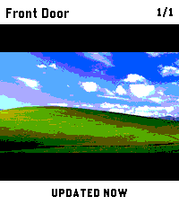

# PinHole

Check your security cameras from your Pebble Time 2.

PinHole is built for fast wrist checks: switch cameras with the hardware buttons, refresh the current view with SELECT, and keep the last good snapshot on screen while the next one loads. It can fetch directly from go2rtc, Frigate, UniFi Protect, or an arbitrary HTTP(S) JPEG snapshot URL.

## Install

Install PinHole from the [Pebble Appstore](https://apps.repebble.com/789d24302fcd416ab4f68cf4), or download a tagged PBW from [GitHub Releases](https://github.com/tylxr59/PinHole/releases).



## Features

- Check cameras without opening your phone
- Built around Pebble's hardware buttons for quick, one-handed use
- Talks directly to your configured camera service from the paired phone
- Supports Frigate accounts, HTTP Basic, Bearer tokens, and `X-API-Key`
- Keeps the previous frame visible while a fresh snapshot loads
- Supports multiple cameras through the companion app settings
- Holds the backlight after a new frame arrives so you can actually inspect it
- Shows clear setup, loading, retry, and error states on the watch

## Requirements

- Pebble Time 2, `emery`
- A JPEG snapshot endpoint reachable from the paired phone
- go2rtc, Frigate, UniFi Protect, or a custom HTTP(S) snapshot URL
- Pebble SDK 4.x / Pebble Tool, only if you want to build locally

Provider presets generate these snapshot requests:

```text
go2rtc: <base>/api/frame.jpeg?src=<stream>&w=200
Frigate: <base>/api/<camera>/latest.jpg?height=172
UniFi:   <base>/proxy/protect/integration/v1/cameras/<id>/snapshot
```

Custom sources use the complete snapshot URL supplied for each camera. RTSP, RTSPS, MJPEG, and video streams are not supported.

## Setup

Open PinHole from the Pebble companion app settings and configure:

- **System**: go2rtc, Frigate, Ubiquiti UniFi Protect, or custom URLs
- **Base URL**: the service URL reachable from the paired phone
- **Authentication**: none, Frigate account, HTTP Basic, Bearer token, or `X-API-Key`
- **Cameras**: add a display name and the provider-specific stream name, camera name, camera ID, or snapshot URL

The settings page contains guided Frigate and UniFi Protect instructions. Unauthenticated cameras can be previewed before saving. Because the settings webview cannot attach authentication headers, save authenticated cameras and test them with SELECT on the watch.

### Frigate

For authenticated Frigate access, use the authenticated API (normally port `8971`) with a certificate trusted by the paired phone. Choose **Frigate account** and use a dedicated viewer or camera-restricted account. PinHole logs in at `/api/login`, retains the session cookie, and logs in again after an HTTP 401.

For an isolated trusted LAN, Frigate's internal port `5000` can be used without authentication:

```text
System: Frigate
Base URL: http://192.168.1.10:5000
Authentication: None
Camera: Front Door / front_door
```

Port `5000` treats callers as anonymous with admin-equivalent API access. Never expose it outside a trusted network. Frigate generates a self-signed certificate for port `8971` by default; PinHole cannot ignore certificate errors, so the paired phone must trust that certificate or the connection must use a trusted reverse proxy/certificate. See [Frigate authentication](https://docs.frigate.video/configuration/authentication/) and [Frigate TLS](https://docs.frigate.video/configuration/tls/).

### Ubiquiti UniFi Protect

Create an API key in UniFi Site Manager under **Settings → API Keys**, then choose **X-API-Key** in PinHole. Use either:

```text
Cloud connector base URL:
https://api.ui.com/v1/connector/consoles/<console-id>

Local console base URL:
https://<console-address>
```

Enter the Protect camera ID shown in its device URL. The cloud connector requires UniFi remote access. Local access requires the console certificate to be trusted by the paired phone. See the official [UniFi Protect snapshot API](https://developer.ui.com/protect/v6.0.53/get-v1camerasidsnapshot).

### go2rtc and Custom URLs

Existing go2rtc configuration is migrated automatically. For go2rtc, enter the stream alias only and optionally select a snapshot cache duration. For a custom source, enter a complete URL such as:

```text
http://camera.local/snapshot.jpg
```

## Controls

- **UP**: previous camera and fetch a new frame
- **DOWN**: next camera and fetch a new frame
- **SELECT**: refresh the current camera
- **BACK**: exit the app

## Troubleshooting

- **SET BASE URL**: a provider base URL is empty.
- **SET SNAPSHOT URL**: a custom snapshot URL is empty.
- **ADD CAMERAS**: no cameras have both a display name and source value.
- **AUTH FAILED**: Frigate rejected the configured account.
- **AUTH RATE LIMITED**: Frigate temporarily rate-limited login attempts.
- **HTTP 401 / 403**: the selected authentication is invalid or cannot access that camera.
- **HTTP 404**: the provider URL or camera identifier is incorrect.
- **TIMEOUT / PHONE TIMEOUT**: the paired phone cannot reach the configured service or PebbleKitJS did not answer the watch request.
- **JPEG DECODE FAILED**: the endpoint did not return a decodable JPEG image.

For unauthenticated sources, open the generated URL from the paired phone's browser. Authenticated sources must be tested from the watch because browser image previews cannot attach the configured headers.

## Privacy and Security

PinHole does not operate an external service or proxy. Snapshot requests are made by the paired phone directly to the endpoint you configure. The optional UniFi cloud connector is an Ubiquiti service selected explicitly by the user.

Camera names, sources, base URL, authentication method, and credentials are stored in the Pebble companion app's local storage for this app. They are not sent to the watch or a PinHole server.

HTTP endpoints are supported for local integrations, but HTTP does not encrypt credentials or images. Use authenticated HTTP only on a trusted network. HTTPS certificate verification is controlled by the paired phone; PinHole cannot accept an untrusted self-signed certificate on the user's behalf.

## Development

Install dependencies and build the PBW:

```bash
npm ci
npm run build
```

Install to the Time 2 emulator:

```bash
npm run install:emery
```

Install to a connected watch:

```bash
pebble install --phone <phone-ip>
```

The compiled package is written to:

```text
build/PinHole.pbw
```

## Releases

Pushing a version tag such as `v1.2.2` runs the GitHub Actions release workflow. The workflow verifies that the tag matches `package.json`, runs the test suite, builds the PBW, uses the matching `CHANGELOG.md` entry as the release notes, uploads the PBW as a workflow artifact, and attaches it to the matching GitHub Release.

To repair a missing or outdated PBW for an existing tag, open **Actions → Release PBW → Run workflow** and enter that tag. Manual runs check out the exact tag before rebuilding and replacing the release asset. Release current code with a new version and tag instead of reusing an older tag.

## Project Layout

```text
src/c/                 Pebble C app and UI
src/pkjs/              PebbleKitJS bridge, settings page, fetch/decode pipeline
src/pkjs/vendor/       Vendored JPEG decoder source
test/                   Provider URL, migration, auth-header, and settings tests
package.json           Pebble metadata and message keys
wscript                Pebble SDK build script
CHANGELOG.md            Versioned user-facing release notes
tools/                  Release-note extraction tooling
pebble-appstore.md     Version-controlled Pebble Appstore listing copy
THIRD_PARTY_NOTICES.md Third-party attribution and licensing
```

## License

PinHole is licensed under the terms in [LICENSE](LICENSE). The vendored JPEG decoder has separate attribution and Apache-2.0 terms documented in [THIRD_PARTY_NOTICES.md](THIRD_PARTY_NOTICES.md).

## Notes

PinHole currently targets `emery` only. The settings page is generated locally by PebbleKitJS and stores configuration on the paired phone. Older go2rtc `{name, stream}` camera lists and fixed camera slots are migrated to the current source format. The JPEG decoder in `src/pkjs/vendor/` is derived from the `jpeg-js` decoder and kept in-tree with small ES5 compatibility edits for Pebble's older webpack toolchain.

AI assistance was used during development for code review, UI polish, documentation drafting, and implementation support. The app behavior, configuration choices, and release decisions were reviewed by the project maintainer.
